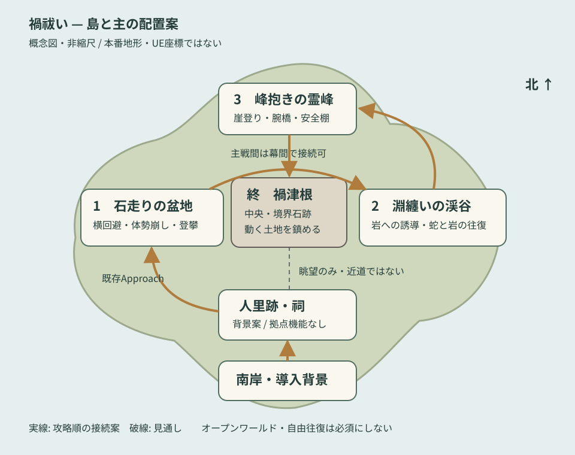

# 3. 島全体と各主のレベルデザイン

状態: 非縮尺の概念地図 / 本番Map未実装。地図の方位・配置は本版の提案で、既存UE座標を表さない。

実線は攻略順の接続、破線は見通しのみで歩ける近道ではない。主戦間は既存の幕間カードとレベル遷移でつないでもよい。南岸と人里跡は導入背景の候補であり、別の探索マップ・拠点システムを必須にしない。

## 地域の役割

| 地域 | 見せるもの | 導線・制約 | 今回の扱い |
|---|---|---|---|
| 南岸 | 傾いた鳥居、遠くの山 | 導入の方角を示す。追加戦闘なし | プロローグ背景候補 |
| 人里跡・祠 | 祈りの痕、境界石への視線 | 村人や会話を作らず不在を物で伝える | 反復訪問の拠点は作らない |
| 石走りへの接近路 | 杉、足跡、倒木、壊れた境界 | 既存Approachの13地点構成を基準にする | ソースあり、実機未検証 |
| 西の盆地 | 巨猪、移動跡、広い回避空間 | 横回避と膝つき後の前脚への接近を妨げない | 既存Arena/Basinの本番化案 |
| 東の水没渓谷 | 水面、誘導岩、岩棚 | 誘導岩とRecovery入口を混同させない | 淵纏いの配置契約を維持 |
| 北の霊峰 | 麓、崖、腕橋、高所の棚 | 主の姿勢変化で道がつながる | 峰抱きの固定ルートを維持 |
| 中央の境界石跡 | 黒い根、岩柱、腐食樹木 | 三体の後で中央核へ。第四の主は置かない | 禍津根のルートを維持 |

## 各戦闘空間の配置優先順位

- 石走り: 突進直線と横回避先を確保 → 反撃箇所を見せる → 5秒のMount Windowで前脚へ接近できる距離を測る → 装飾を置く。装飾物でGrabを塞がない。
- 淵纏い: 誘導位置 → 指定岩 → Snaggedした頭 → 蛇と休息岩の接続 → 落下復帰入口の順に読みやすさを確認する。深水・水面表現は既存落下判定を変えない。
- 峰抱き: 脚から背中への入口 → 崖登り中の身体 → 腕橋 → 頭部 → 落下時の安全棚。遠景は高さを示すが、進行方向の視認性を優先する。
- 禍津根: 根の入口 → 第一禍根 → 岩と根の往復 → FinalRise → 中央核。主戦で学んだ手掛かりを再利用する。

## ゲーム内の章順

`Title → Prologue → IshibashiriApproach → Ishibashiri → Interlude1 → Fuchimatoi → Interlude2 → Minedaki → Interlude3 → Magatsune → Ending → Completed`

章数は12。既存 `CampaignFlow.md` の「11個」は記述が古いため、現行enumを基準に読む。この提案のために新しい章や迂回クリア経路を追加しない。

接近路の既存設計目安は3～5分。残りの移動時間、マップ寸法、遭遇難易度は未確定であり、未検証の数値を制作上限として固定しない。

## 工数を増やさない制作手順

既存の床・岩・木・境界石を共通キット化する想定で、まず石走りへの接近路と盆地だけを本番品質の基準にする。他地域は同じキットの配置と材質で差を付ける。村、天候シミュレーション、自由往復の島、収集要素は初版の必須範囲に含めない。

鎮静後はマップ全体を再生成しない。既存の禍の表示、環境音、主の状態を切り替える方針とし、水の透明化や植物の再生は追加候補に留める。
