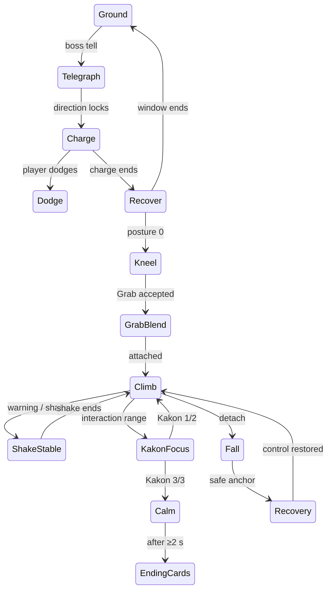

# 石走り編 Production Camera Contract

Status: **DESIGN LOCK; current implementation evaluated; runtime tuning pending**  
Baseline and evidence labels are defined in [IshibashiriFinalGameplaySpec](IshibashiriFinalGameplaySpec.md).

## 1. Current camera evidence

**SOURCE:** normal spring arm is 740 cm, socket offset `(0,70,110)`, 95° FOV, pawn-control rotation and no camera lag. Pitch is clamped -65° to +20°. Grab FOV is 88°; climbing is 100°, +3° during shake, interpolated at speed 5. Climbing camera sits approximately 560 cm behind view direction and 160 cm above the player, uses location interpolation speed 8, and if its point lies inside the boss it moves 650 cm outward/340 cm up. A 15 cm sphere sweep tests world collision while intentionally ignoring Ishibashiri.

Ground obstruction detects Ishibashiri on Visibility rather than letting it collapse the spring arm. Imported-model fallback moves 700 cm away from the boss and 280 cm up. Wall fallback can raise to 720 cm (boss framing target 1,000 cm). Normal return waits 0.15 s and blends position/focus for 0.35 s, rechecking collision.

**RUNTIME history, not current-SHA proof:** `Docs/CameraIntegrationValidation.md` records Windows UE 5.6.1 camera runs at 30/60/120 FPS and capture review after an older integration. Mouse/physical gamepad feel and current SHA are not validated. Camera logic currently has no explicit state assists for Telegraph, Dodge, Recover, Kneel, Kakon or Calm and no authored collision fallback for rocks/trees/Kakon beyond generic Camera-channel sweeps.

## 2. Production principles

1. The 12 m lord must retain mass: favor a low three-quarter view and foreground occlusion over a distant tactical camera.
2. The player, immediate danger and readable piece of Ishibashiri share the frame; the full body need not always fit.
3. Ishibashiri may move violently; the camera remains one level calmer. Never fully inherit boss pitch/yaw/roll.
4. Assists are short, additive and interruptible by meaningful player camera input. Gameplay works with every assist disabled.
5. No Sequencer dependency or long cinematic.

## 3. Ground camera contract

| State | Distance / height / FOV target | Framing and assist |
|---|---|---|
| Normal encounter | **740 cm arm**, +110 cm socket, lateral shoulder +70 cm, **95°** | Player at lower-left/right third (about 40% horizontal, 65% vertical); camera yaw remains player-owned. At boss distance >25 m, no zoom. At 12–25 m, bias focus up to 15% toward chest. Under 12 m, retain player and near limb/head rather than backing far enough to fit the whole body. |
| First encounter | 8–10 m camera-to-player equivalent, **90°**, 2.0–2.5 s maximum | Low three-quarter framing includes player, foreground scale reference and most of silhouette. Camera assist ≤12° yaw / ≤6° pitch, cancelled by look input. Control remains available after first 0.5 s. |
| Telegraph/Charge | **95–98°**, max +3° from base | Telegraph biases look 10% toward head/forelegs. At launch, widen smoothly by ≤3° over 0.20 s; no forward shake and no homing pan. Preserve lateral escape side. |
| Dodge | 95–98° | Camera does not roll, snap or rotate with dodge direction; positional catch-up only. Player remains visible through the 420 cm displacement. |
| Recover | **93–95°** | Ease focus toward corrupted foreleg/horn by ≤10° for at most 1.0 s; player look immediately overrides. Do not zoom onto a “weak point.” |
| Kneel | **90–93°**, 1.0 s settle | Briefly lower focus to show head/foreleg and player together. Assist ≤15° yaw, then return control. Do not cut. |
| Grab approach | **88°** current target, 0.48 s fallback | Frame hands/hold and enough body to preserve direction; blend from ground, never teleport camera. |

The current 700/280 boss-obstruction retreat is retained as the **first fallback**, because it avoids overhead “ordinary boar” framing. However, it currently looks only at the player and can lose the danger source; Production focus should blend 15–25% toward the nearest readable boss feature while never reversing movement axes.

## 4. Scale beats

- **Reveal:** 80–120 m silhouette with foreground scale; no orbit.
- **Charge:** keep low horizon and allow body to cross frame; widening rather than pulling far away.
- **Lateral dodge:** preserve charge vector and open side; no auto-centering until Recover.
- **Kneel:** head/foreleg fills one side; player stays visible at the other lower third.
- **First Grab/front leg:** close enough to read hand/hold, with shoulder/head edge establishing scale.
- **Front leg climb:** show vertical body surface above and a sliver of ground below.
- **Shoulder/branch:** show shoulder silhouette and right-branch destination; do not expose route graph.
- **Highest back:** slightly wider 98–100° composition shows horizon and body curvature, not the whole creature.
- **Purification:** 0.8–1.0 s focus weighting to the nearby Kakon/body response, without taking rotation ownership.
- **Calm:** settle at low rear/side three-quarter so breathing, player and living head/torso remain readable for at least 2 s.

## 5. Climbing camera contract

| Axis | Final rule |
|---|---|
| Base | Keep **560 cm behind / +160 cm**, **100° FOV**. Permitted contextual envelope is 480–650 cm and +120–340 cm. |
| Pitch range | Controller remains -65° to +20° globally for now; when climbing, soft-limit useful framing to approximately -55°/+15° and resist only the last 5°, never snap. Validate whether UE pitch sign/display matches player expectation. |
| Look target | Player +40 cm, then add at most 20% toward the next enabled hold and at most 10% toward the current Kakon. Never target boss root/transform origin. |
| Route assist | At rest/branch after 1.0 s without look input, bias ≤12° toward next enabled physical hold over ≥0.45 s. Any right-stick/mouse input suspends assist for 1.5 s. |
| Shake | Current +3° FOV is allowed. Add only positional noise ≤4 cm and rotational noise ≤0.35° at low frequency; no repeated impact snaps. Camera location follows filtered player movement, not raw boss animation. |
| Cling | Stabilize focus and reduce optional shake by 50%; do not tunnel FOV or lock look. |
| Rest | Settle back to 100°; after 0.5 s, frame next safe traversal and leave manual look intact. |
| Node 5 branch | One ≤12°/0.6 s right-shoulder bias plus environment/Sense cue. Returning to main route gets the symmetric assist once. |
| Kakon | Within interaction range, weight focus ≤10% for ≤1.0 s. On purification, use light/body response; no cut-in. |
| Fall | Preserve yaw/horizon, widen to **103° max**, follow vertical motion with 0.20 s delay; do not pitch straight down or roll. |
| Recovery | Blend from fall to safe anchor over **0.45–0.70 s**; fade only if collision cannot resolve within 2 s. Give full look control immediately after placement. |

The camera indicates a direction but never chooses a route or rotates the character. Location interpolation speed 8 remains the starting value; camera focus/rotation interpolation must be independently implemented at **6 s⁻¹**, so a moving body cannot inject frame-frequency orientation jitter.

## 6. Motion-sickness limits

- **Rotation shake:** ≤0.35° per axis in normal settings; roll ≤0.15°. Reduced Motion makes rotation shake 0°.
- **FOV:** default state changes are within 88–103°, but any single gameplay transition changes by **≤5°** from its entering value; rate ≤15°/s. The 95→88 Grab transition therefore blends in stages/over ≥0.5 s rather than snapping.
- **Position lag:** no general spring-arm lag on ground (retains input precision). Climb location uses interpolation 8 s⁻¹; rotation/focus uses 6 s⁻¹. Collision retreat is allowed to be faster than return.
- **Boss transform inheritance:** player position necessarily follows authored holds; camera inherits **0% raw boss roll**, ≤10% filtered pitch, and ≤20% filtered yaw only through the changing world look target. Never attach the camera to the boss transform.
- No camera snap except an emergency collision escape. No repeated recenter, head bob, dolly zoom, radial blur requirement or forced motion blur.
- Assists are disabled while the player supplies look input and can be disabled globally by a future Camera Assist option. Reduced Motion also disables positional shake and halves FOV deltas.

## 7. Collision and occlusion

| Obstacle | Current evaluation | Production rule |
|---|---|---|
| Ishibashiri | Ground detects Visibility and uses 700/280 retreat; climb ignores boss in sweep and tests whether desired point is inside bounds. | Retain non-arm-collapse behavior. Search first along outward arc (left/right up to 35°), then 700/280 retreat. Never place camera inside body. |
| Walls / arena | 12 cm ground and 15 cm climb sphere sweeps; wall can cause raised view. | Retain sweeps; collision must blend, not alternate each frame. Return hysteresis 0.15 s + 0.35 s remains minimum. |
| Rocks / trees / ground | Covered only if assets block Camera channel. | Every production proxy must use Camera collision or fade policy. Test trunks, overhang, floor and basin edge explicitly. Foliage may fade; solid rock may not be ignored. |
| Back rocks / Kakon | Boss is ignored in climb sweep, so attached obstacle geometry may not independently protect the camera. | Mark non-gameplay Kakon/foliage camera-transparent; route rocks either fade or participate in a dedicated climb-camera trace. Never push through a Kakon into the body. |
| Narrow space | No dedicated minimum-distance fallback beyond ground `MinimumCameraDistance=300`; climb sweep may put camera at the hit point. | Maintain **300 cm desired minimum**, **220 cm emergency minimum**. Below 300 cm, widen up to 103°, raise up to 120 cm and fade the near occluder. Below 220 cm for >0.15 s, use a high shoulder fallback 320 cm away/+220 cm; do not continue collapsing onto the player. |

Collision ordering is: valid normal view → same-side outward arc → raised/shoulder fallback → near-occluder fade → emergency high shoulder. It never jumps across the character/boss line because that reverses controls. Debug displays active fallback and hit actor; normal HUD does not.

## 8. Short camera assists and state machine

Initial encounter, Kneel, first Grab, Kakon 3/3 and Calm may use the bounded assists above. None requires Sequencer; all use the gameplay camera, preserve collision, and are interruptible except the emergency collision move. A failed assist must leave gameplay readable.

## 9. Minimal implementation and runtime gate

Keep the present spring arm, CalcCamera path, FOV interpolation, obstruction detection and return hysteresis. Add a small camera presentation state/weights (not a camera framework), independent focus interpolation, route look-target metadata, collision arc/emergency fallback, and Reduced Motion/assist seams. Do not tune against absent final assets beyond collision proxies.

Runtime checks: 30/60/120 FPS; mouse and physical gamepad; four arena walls; boss between player/camera; tree/rock/ground/back-rock/Kakon/narrow gap; repeated obstruction edges; every state in the diagram; player at screen thirds; first reveal scale; no axis reversal; maximum recorded FOV/rotation/roll; intentional fall/recovery; Reduced Motion. Current-SHA results remain **NOT_RUN** until Windows UE evidence is captured.
