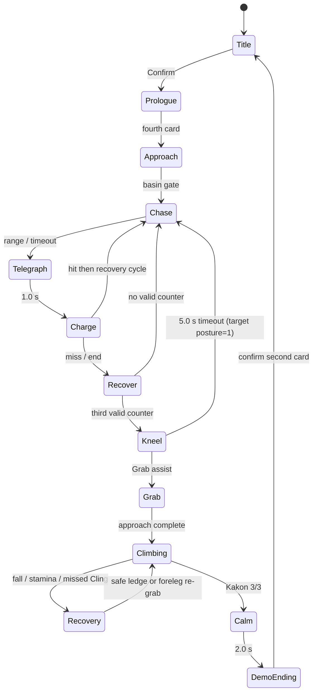

# 石走り編 Final Gameplay Specification

Status: **DESIGN LOCK / source deltas identified / human first-play NOT_RUN**  
Baseline: local `main` merge `316d79f014130c1919b1f035c25526db57cb9c31` (2026-09-28). `git fetch https://github.com/sasazaki1994/UE.git main` was attempted on 2026-09-28 UTC and rejected by the environment proxy (HTTP 403); remote freshness is therefore **UNVERIFIED**.

## 1. Evidence boundary and product intent

This document freezes the Production target; it does not claim that every target value is already implemented. Evidence is labelled as follows.

- **SOURCE**: C++/configuration and source-contract tests presently implement it.
- **DOC**: an existing document or Acceptance contract says it, but this review did not execute it.
- **RUNTIME**: checked in a named UE run. Existing camera records include historical Windows UE runs; the current SHA has not been built or played in this Linux environment.
- **TARGET**: the final decision. A target different from SOURCE is listed in §14 and must not be described as shipped.

The emotional contract is: observe a mountain lord, survive without damaging it, expose a climbing opportunity, remove only three corruptions, and see its breathing settle. The invariant loop is:

```text
Title → Prologue → IshibashiriApproach → Encounter
→ read 1.0 s telegraph → lateral dodge → 1.65 s Recover counter (three cycles)
→ 5.0 s Kneel/Grab → fixed 11-node climb → read warning/Cling/Rest
→ right shoulder Kakon 1 → summit Kakon 2 → rear Kakon 3
→ Calm → Encounter Completed → two short ending cards → Title
```

Ground attacks change posture only in the valid Recover window. Only three distinct Kakon authorize Calm. Boss HP, death, disappearance, loot, free climbing, open-world exploration, and a second combat system are explicitly out of scope.

## 2. Approach

| Decision axis | Current implementation / evidence | Problem | Final Production specification | Change and first-play check |
|---|---|---|---|---|
| Duration/distance | **SOURCE/DOC:** deterministic 13-point, approximately 1,311 m route; 600 cm/s pawn speed; about 3.6 min uninterrupted and 3–5 min with observation. | 1,311 m is long only if landmarks fail to change the question; shortening it before evidence risks losing the quiet/scale setup. | Target **3–4 min median, 5 min p90** from control return to basin gate. Retain 1,311 m for the first Production playtest; trim repeated second-forest slabs, not the landmark beats, only if p90 exceeds 5 min or players call the repetition empty. | No immediate geometry change. Record gate time and where sprinting/attention drops. |
| Locomotion | **SOURCE:** one 6 m/s ground speed; there is no walk/run toggle or sprint resource. | Calling this a walk misrepresents the animation/input; forcing slow walking would inflate dead time. | Full-stick/WASD is a controlled **run/jog**. No forced walk and no sprint mechanic. Landmark clearings naturally slow observation; cards/cues never remove locomotion for more than the existing short warning. | Animation polish only later. Verify players do not feel punished for stopping. |
| Sense | **SOURCE:** Q/LT points coarsely toward the gate; F/LB reports QUIET/TRANSITION/DANGER; neither gates travel. | Requiring a hold would turn discovery into a key check. | Both Senses remain **optional**. Introduce both once, contextually, before the boundary; completion never requires them. | Minimal first-use prompt needed. Check that unaided and Sense-using players both reach the gate. |
| First sight | **SOURCE:** a non-interactive silhouette crosses a gap for exactly 3.0 s; exact player-to-silhouette distance is not contracted. | A time-only cue does not lock scale/readability. | First full silhouette at **80–120 m perceived distance**, visible for 3.0 s, with a foreground tree/stone for scale. No nameplate or combat marker. | Author/validate placement; log measured distance. Check the player sees “huge boar,” not combat beginning. |
| Boundary warning | **SOURCE:** one stone and the subtitle `ここから先へ入るな` for 4 s, safe-area fitted. | Repeating lore or objective prose would over-explain. | Keep the weathered stone, damaged grove, rumble hook and **one 4 s subtitle**. It warns of taboo, not controls or objective. No confirmation modal. | No gameplay change. Ask what the stone meant. |
| Teaching/navigation | **SOURCE:** broad overlapping path slabs and landmark chain; no maze. Existing main HUD only advertises Sense in Campaign. | Combat controls learned at the instant of danger can hide the cause of failure. | Before the gate, teach movement/camera once, optional Sense once, then dodge and attack as two short contextual prompts near the final rumble. Teach Grab/Cling only when relevant. Navigation uses terrain shoulders, cedar framing, footprints, damaged trees, light/fog contrast and the gate—never a permanent breadcrumb arrow. | Add/gate first-use prompts; no new tutorial screen. Verify each input is recalled without coaching. |

No NPC, collectible, branch, puzzle, encounter, lore stop, or extra event is added. The existing boundary, trail, reveal and close rumble are the complete Approach beat set.

## 3. Ground battle: Charge, Dodge, Recover, Posture and Kneel

| Item | Current SOURCE | Problem / interpretation | Final specification | Minimum change / first-play check |
|---|---:|---|---|---|
| Telegraph | 1.00 s | Readable body/audio assets are not yet final. | **1.00 s**, direction tracks the player during Telegraph and locks when Charge starts. Body weight shift + ground response are primary; optional danger text is accessibility only. | Asset polish; verify 80% of first three charges are identified before movement begins. |
| Chase/trigger | 1.20 s nominal; charge at ≤1,400 cm, obstruction timeout at Chase+4 s | Timeout can delay, but prevents deadlock. | Keep. Player should normally enter telegraph by distance, timeout is fallback only. | Telemetry check. |
| Charge | 1,500 cm/s, max 1.35 s; fixed direction | A homing charge would make lateral dodge unreadable. | Keep **15 m/s**, **1.35 s max**, **0 s tracking after launch**. | No change. Verify side dodge succeeds and early dodge can still be punished. |
| Dodge | 1,500 cm/s × 0.28 s = 420 cm; 0.55 s cooldown; invulnerable while dodging; hit i-frames 0.85 s | Input window is implicit rather than a separate buffer. | Keep movement/cooldown. Accept dodge from telegraph start until approximately **0.20 s before contact**; do not add homing. A 0.10 s input buffer/coyote allowance is a target only if first-play input traces show correct presses being lost. | Initially no change; measure press-to-contact. |
| Recover | 1.65 s; one valid counter; only after a miss/no player hit | Correctly teaches evade → punish, but normal UI presently depends on transient feedback. | Keep **Recover-only counter**, **1.65 s**, one posture point per cycle. Physical stagger/left-arm Safe response plus a first-cycle `攻撃` prompt; attacks outside it deflect without harm. | Prompt/presentation change. Verify player attacks during Recover by cycle 2 without coaching. |
| Posture | 3 points; one point per successful Recover | Three repetitions teach the rule without dragging. | Keep **three successful counters / three charge cycles**. Never render a boss-health metaphor. | Hide numeric posture outside Debug. Ask player why the third hit changed state. |
| Kneel / mount | 5.0 s; missing it resets posture to 3 and Chase; mounting commits route | Full three-cycle reset is costly when the player understood combat but missed a positional check. | Keep **5.0 s Kneel** and **5.0 s Grab availability**. A timeout returns to Chase but TARGET preserves two posture breaks (posture=1): one more successful cycle reopens Kneel. Full Retry still resets all. | Small code delta. Measure missed mounts and whether recovery feels fair. |

On a charge hit, Player HP loses one of three points; at zero the encounter ends in Defeat and Retry is offered. This fail state is retained but HP is not a combat objective.

## 4. Grab start

**Current:** the route system has one authoritative node (`Route[0]`) and one gold `ForelegGrabMarker`; range and warp distance are 240 cm, angle 100°, completion tolerance 35 cm/18°, with a 0.48 s visible fallback when the montage is absent. Some older prose says “foreleg or horn,” but source does not provide two independent route starts. Therefore only **one** start is implemented.

**Final:** retain **two generous authored activation volumes**—front leg (primary) and lowered horn/head (secondary)—both resolving to route node 0 and the same fixed route. They are alternatives, not two routes. During Kneel only, contaminated seams converge to a restrained warm-gold glint; gold is retained as a brief affordance, not a permanent collectible beacon. Within 4 m show `E / RB 取り付く` (first time, or always when button prompts are enabled). Accept input within **300 cm**, **120°**, and warp/assist at most 300 cm; never require sub-metre manual alignment. Face correction is part of the short approach animation. A failed press inside the activation volume stays buffered for 0.25 s and gives feedback; it does not consume the window.

This needs a small second-volume/range/prompt change. No free climb, physics grab, or new animation is required. First-play gate: at least 90% of players who reach either highlighted hold and press Grab mount on that press; record press distance, facing and timeout cause.

## 5. Fixed climbing route

The **11-node authored route remains final**. Nodes 0–5 lead front leg → shoulder → back approach; node 5 branches right to nodes 10/9 for Kakon 1, then returns to node 5; nodes 6–8 cross summit to Kakon 2 and rear Kakon 3. Nodes ≥3 are currently Rest nodes—eight nominal safe/rest nodes—which over-flattens stamina decisions.

Production keeps all 11 nodes and the right-shoulder branch because the branch creates one deliberate route read. It does not add hidden branches. Camera, body silhouette, Sense and ledge material point toward the enabled next hold. The player is reading the moving body and upcoming shake, not searching arbitrary collision.

- Intended travel between Kakon interactions: **20–35 s** when the player takes one rest; entire mounted section **90–150 s** on a successful first completion.
- Keep direction-choice traversal rather than analogue precision. Route input threshold remains 0.5; speed remains 190 cm/s pending playtest.
- Reduce meaningful full-recovery rests to **four**: shoulder entry (3), branch junction (5), right-shoulder Kakon (9), summit/rear Kakon shelves (6/8 count as the final pair). Other nodes may support the body but do not refill stamina. Exact node mapping is a small code/data delta.
- At node 5, one contextual branch prompt and subtle camera bias identify the right shoulder. No route number appears outside Debug.

First-play checks: whether node 5 is understood within 10 s, wrong-direction attempts, camera corrections, Kakon-to-Kakon time, and whether players describe shake planning rather than route guessing as the challenge.

## 6. Stamina, Cling, Rest and Shake

| Rule | Current SOURCE | Final Production rule |
|---|---:|---|
| Maximum / minimum re-grab | 100 / 25 | **100 / 25**; stamina is a gauge, never a seconds label. |
| Normal non-rest climbing | 5/s | **5/s**. A full bar supports 20 s continuous traversal, but route timing must always offer a reachable rest before depletion. |
| Rest | +22/s | **+22/s** after 0.25 s settled on a safe ledge; full recovery takes ≤4.6 s. |
| Ground recovery | +18/s | **+18/s**; used after a fall. |
| Warning / frequency | 2.0 s warning; 2.0 s shake at end of each 12.0 s cycle | Keep **2.0 / 2.0 / 12.0 s**. Do not schedule the first shake until at least 6 s after successful Grab. |
| Cling during shake | 18/s | Keep **18/s**; movement pauses. Cling before the shake may be held without extra drain beyond normal traversal. |
| No Cling | 50/s and detach after 0.70 s | The meaningful rule is **0.70 s grace then fall**. Retain the drain internally, but do not present both rules to players. |
| Depletion | detach and outward/up launch | Fall after a clear exhausted cue; never instant-kill. |

**Fall/recovery target:** current Ishibashiri source has no checkpoint recovery anchor: it detaches into world physics; falling below Z -500 ends the encounter and Retry resets everything. Production must minimally place the player on the nearest previously reached safe ledge (or ground foreleg recovery point if none), preserve purified Kakon, restore **50 stamina**, grant **3.0 s shake immunity**, and reopen Grab for **6.0 s**. If world geometry cannot provide that landing within 2 s, teleport/fade to the recovery point; do not make the player repeat ground posture. A manual R/Y Retry remains a full encounter reset (position, posture, Kakon and stamina).

First-play checks: warning noticed before shake, Cling held intentionally, stamina inspected before leaving a rest, no unexplained fall, and recovery-to-control ≤5 s.

## 7. Kakon 1 / 2 / 3

**Discovery:** only the currently reachable, unpurified Kakon participates in Boundary Sense. Without Sense, corruption geometry, dark seams, local light/motion and the stained left arm lead the eye. No always-on red weak-point marker is permitted. Source currently shows the current marker without requiring Sense (`Current` visibility); this is a required HUD/presentation delta.

**Order:** authored and mandatory—right shoulder (1), summit (2), rear back (3). Future-phase targets remain hidden from Sense. The player may return along the fixed route but cannot purify out of order.

**Operation:** at a safe ledge within 170 cm, one Attack/X press commits the existing 0.53 s purification swing; completion is at the hit/animation event and the existing 0.35 s convergence tail confirms it. Target interaction time is **0.8–1.0 s perceived**, not a multi-second hold. Shake is suppressed from input commit through **1.5 s after completion**; an already active shake rejects the action and retains the input prompt until safe. Each distinct Kakon increments once.

**Feedback:** body/arm response and a restrained pulse are primary. A compact transient `禍根 1/3`, `2/3`, `3/3` appears for **1.5 s**; there is no always-on counter in normal traversal. Sense may show the next coarse direction/strength, never an exact distance or objective arrow.

First-play checks: how each Kakon was found, whether the order feels authored rather than arbitrary, accidental attacks, confirmation recognition, and whether a shake can interrupt/mask completion.

## 8. Calm and short ending

Three distinct purifications trigger the existing `OnAllPurified → CalmNushi → Encounter Completed` authority. “Victory” remains an internal result/log/test term only and is **not drawn in Production**. On 3/3:

1. Input is safely released, attack/shake stop, combat danger presentation and the future battle BGM layer begin a **1.0 s fade** immediately. No production audio asset is assumed; this is a mixing contract.
2. Gameplay camera remains active with a gentle Calm assist (camera contract): no cut, no death pose, no disappearance. The stone/vegetation response and breathing return communicate rescue.
3. Hold the calm living Ishibashiri for **2.0 s minimum** (the current Campaign advance timer), then show `石走りは鎮まった` / `Encounter Completed` for at most 1.5 s if the card transition is not already covering it. Do not show `VICTORY`.
4. Keep the existing two ending cards: `石走りは生きている。息が戻る。` and `水の底で、同じ脈動が続いている。`
5. Cards advance by the existing confirm input; after confirming card 2, return automatically to Title. Do not add a third “return” input, countdown, or next-boss tease.

The existing source stops combat immediately and advances Campaign after 2 s, and the two-card ending returns to Title; the Production label/HUD and Calm framing are small deltas. Verify that an unprompted first-time player says the creature survived/was helped.

## 9. Retry contract

- `R / Y` is situational on Defeat and in the pause/help surface; it is not a permanent combat banner.
- Full Retry resets player/boss position, HP, posture, stamina, Sense, all three Kakon and timers, and never advances Campaign.
- A climbing fall uses the local recovery rule in §6, not full Retry. Three falls in one mounted attempt may additionally offer (not force) full Retry.
- Demo save remains isolated; returning to Title occurs only after the ending cards.

## 10. State transition diagram



## 11. Required evidence per major beat

For every first-play record, capture what the player **saw**, what they **said/appeared to understand**, and what they **pressed**: boundary/silhouette; telegraph/lateral Dodge; Recover/Attack; Kneel/Grab; route branch; warning/Cling; Rest/stamina; each Kakon; fall/recovery; Calm/two cards/Title. Record misunderstanding before interpretation and never substitute automated E2E for human comprehension.

## 12. What is already fixed without code

Demo chapter order and save isolation; three Recover counters; 1.0/1.35/1.65 s combat timing; fixed charge direction and 15 m/s; 5 s Kneel; fixed 11-node route/right-shoulder branch; 100 stamina, base drain/recovery values, 12/2/2 s shake cadence; three ordered unique Kakon as sole Calm authority; living Calm; two ending cards and Title return. These are now design-locked pending defect evidence, not open feature discussions.

## 13. Explicit non-goals

No free climbing, open world, boss HP/death, new weapon, skill tree, GAS, Motion Matching rewrite, new map/boss, long cinematic, Sequencer dependency, large UI framework, or assumption of finished model/environment/audio/VFX assets.

## 14. Minimal source changes required before Production gate

1. Change Kneel timeout from posture 3 to posture 1.
2. Add a second generous horn/head activation volume while resolving both starts to node 0; tune Grab to 300 cm/120°, add 0.25 s buffer and contextual prompt.
3. Make Kakon/route presentation Sense- or context-gated; remove always-current marker from normal play.
4. Replace “all nodes ≥3 rest” with authored meaningful rest flags.
5. Add local fall recovery preserving Kakon, 50 stamina, 3 s shake immunity and a 6 s re-grab opportunity.
6. Delay first shake after mount; defer shake during purification and for 1.5 s after it.
7. Replace Production `VICTORY` and permanent counters/instructions according to the HUD spec; add first-use prompt policy.

These are bounded changes to existing state/data paths. Everything else in this specification is tuning, presentation/asset replacement, or evidence collection.
