# 古祀の盆地 Before / After 実機画像比較

実際のUE画面8場面・16枚をコピーした記録。画像の生成、リサイズ、加工は行っていない。
撮影ログの完了RunIdと、そのRunIdのPNGを対応させている。各ファイルのSHA256・実寸・元ログ位置は [比較記録JSON](KoshiBasinComparison.json) に保存した。

Climbingは複数routeが同名PNGを上書きするため、各RunId・shot名の**最後のmetadata記録**を選択した。ログのcamera/FOV一致判定は記録された丸め値の比較であり、未丸めのTransformや露出の精密一致を意味しない。

EnvironmentはAIを停止して配置した視覚比較。Basinは通常AIと入力による場面、Climbingは取り付き配置を含む検証場面。これらの画像だけで人間の操作感、物理ゲームパッド、描画性能、音質を検証したとは扱わない。

| 場面 | 位置差 cm | 最大回転成分差 ° | FOV差 ° | ログ上のcamera一致 |
| --- | ---: | ---: | ---: | --- |
| 盆地の入口 | 0.000000 | 0.000000 | +0.000000 | 記録値一致 |
| 石走りとの初対峙 | 0.000000 | 0.000000 | +0.000000 | 記録値一致 |
| 盆地全景 | 0.000000 | 0.000000 | +0.000000 | 記録値一致 |
| 石走りの突進 | 0.000000 | 0.000000 | +0.000000 | 記録値一致 |
| 石走りへの接近 | 0.000000 | 0.000000 | +0.000000 | 記録値一致 |
| 登攀中の高所視点 | 0.000000 | 0.000000 | +0.000000 | 記録値一致 |
| 禍根浄化後の1/3状態 | 0.000000 | 0.000000 | +0.000000 | 記録値一致 |
| 鎮静後の風景 | 0.000000 | 0.000000 | +0.000000 | 記録値一致 |

回転差はPitch/Yaw/Roll各成分の最短角差を比較した値。位置差がある場面は、固定cameraの厳密な対比と称さず、記録した差を含む状態別の品質比較として読む。

## 盆地の入口

撮影元: `Environment/06-BasinEntrance`。Before RunId `a5369c296aa84f30b662572ac6b68db1`、After RunId `43d4a7092d6648538a32e5cd53dddd51`。

| Before | After |
| --- | --- |
| 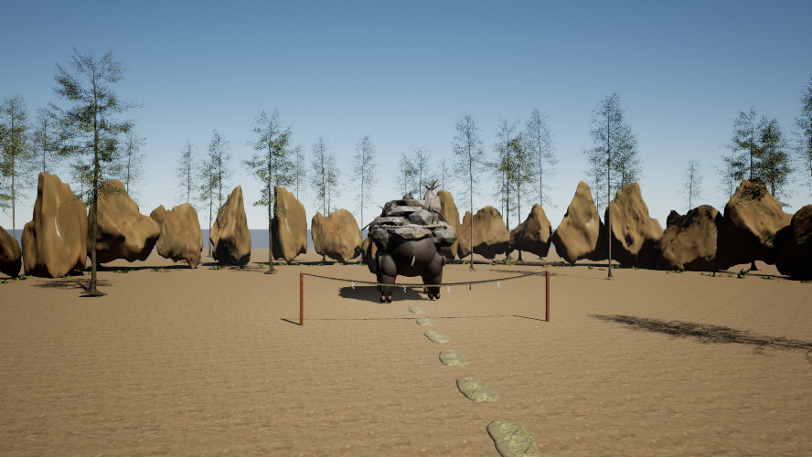 | 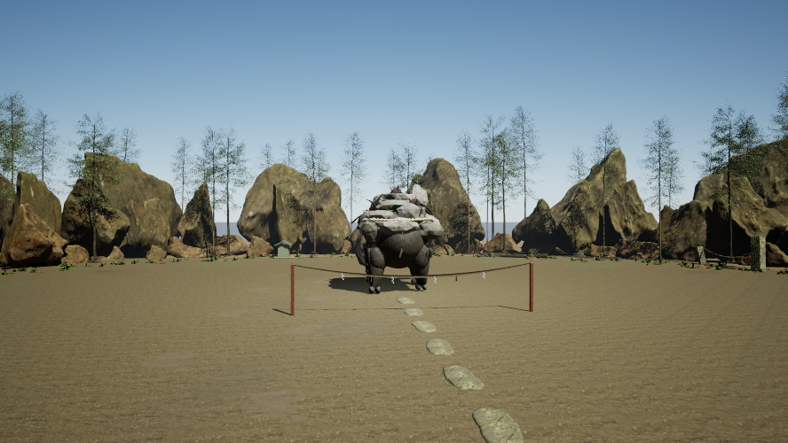 |

実PNG: 888×500 / 888×500。位置差 0.000000 cm、FOV差 +0.000000°。

位置差XYZ (cm): `{"x": 0.0, "y": 0.0, "z": 0.0}`。回転差PYR (°): `{"pitch": 0.0, "yaw": 0.0, "roll": 0.0}`。

## 石走りとの初対峙

撮影元: `Basin/01-Start`。Before RunId `29d85fce236a467c9ac0f6246843241d`、After RunId `921d5db7810741fa8f491a305252b371`。

| Before | After |
| --- | --- |
| 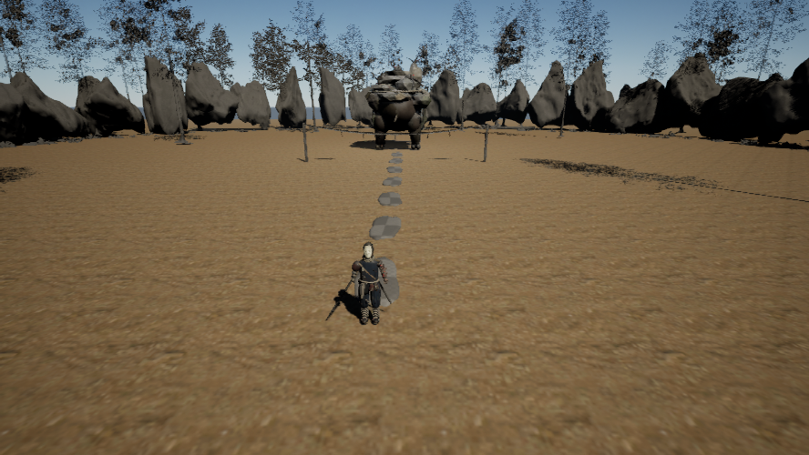 | 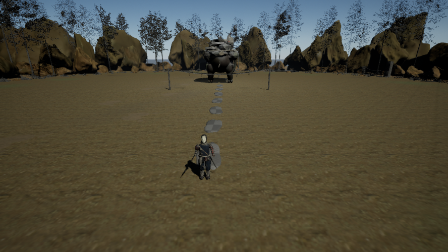 |

実PNG: 888×500 / 888×500。位置差 0.000000 cm、FOV差 +0.000000°。

位置差XYZ (cm): `{"x": 0.0, "y": 0.0, "z": 0.0}`。回転差PYR (°): `{"pitch": 0.0, "yaw": 0.0, "roll": 0.0}`。

## 盆地全景

撮影元: `Environment/07-BasinWide`。Before RunId `a5369c296aa84f30b662572ac6b68db1`、After RunId `43d4a7092d6648538a32e5cd53dddd51`。

| Before | After |
| --- | --- |
| 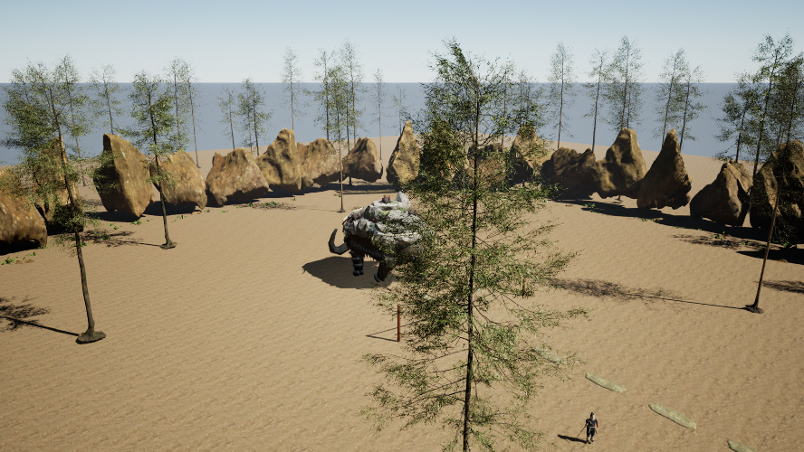 | 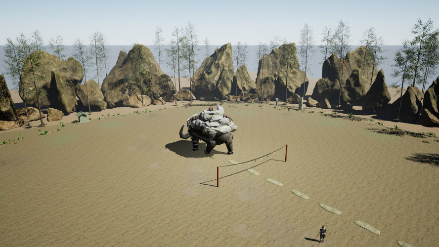 |

実PNG: 888×500 / 888×500。位置差 0.000000 cm、FOV差 +0.000000°。

位置差XYZ (cm): `{"x": 0.0, "y": 0.0, "z": 0.0}`。回転差PYR (°): `{"pitch": 0.0, "yaw": 0.0, "roll": 0.0}`。

## 石走りの突進

撮影元: `Basin/06-Charge`。Before RunId `29d85fce236a467c9ac0f6246843241d`、After RunId `921d5db7810741fa8f491a305252b371`。

| Before | After |
| --- | --- |
| 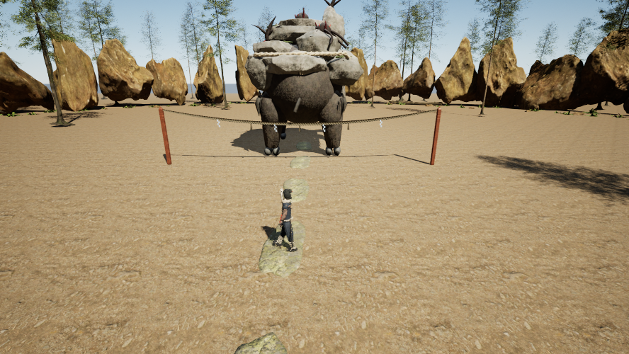 | 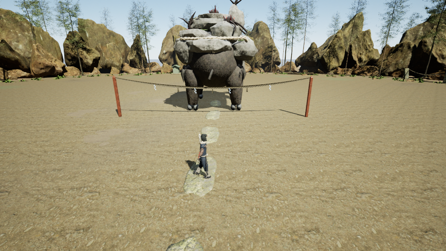 |

実PNG: 888×500 / 888×500。位置差 0.000000 cm、FOV差 +0.000000°。

位置差XYZ (cm): `{"x": 0.0, "y": 0.0, "z": 0.0}`。回転差PYR (°): `{"pitch": 0.0, "yaw": 0.0, "roll": 0.0}`。

## 石走りへの接近

撮影元: `Basin/02-BeforeMount`。Before RunId `29d85fce236a467c9ac0f6246843241d`、After RunId `921d5db7810741fa8f491a305252b371`。

| Before | After |
| --- | --- |
| 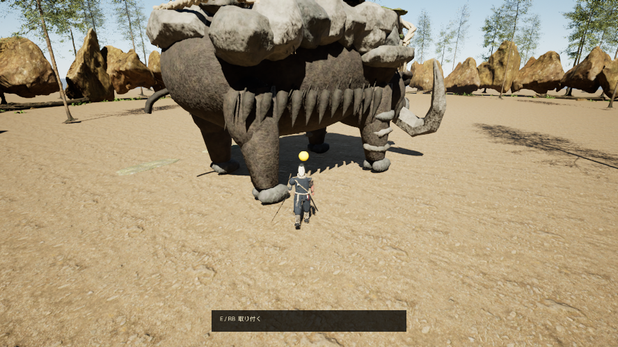 | 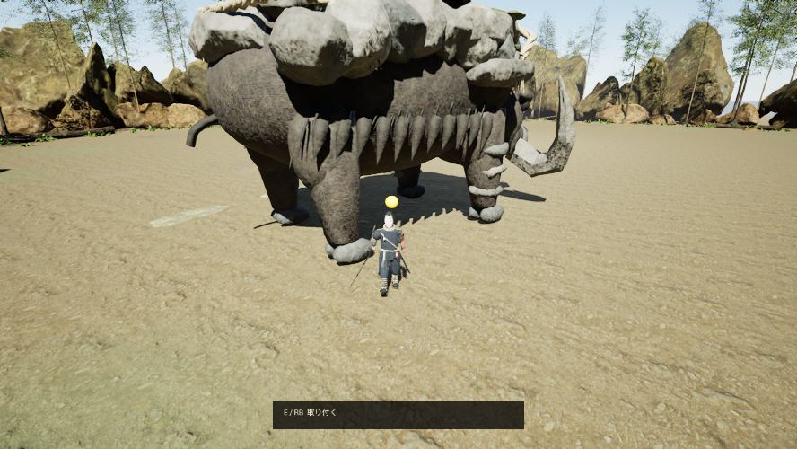 |

実PNG: 888×500 / 888×500。位置差 0.000000 cm、FOV差 +0.000000°。

位置差XYZ (cm): `{"x": 0.0, "y": 0.0, "z": 0.0}`。回転差PYR (°): `{"pitch": 0.0, "yaw": 0.0, "roll": 0.0}`。

## 登攀中の高所視点

撮影元: `Climbing/04-Summit`。Before RunId `4cb2cbc67955419596bcb45d8beec3b5`、After RunId `24d5ba6c2d744a6593a47a6c3a08c352`。

| Before | After |
| --- | --- |
| 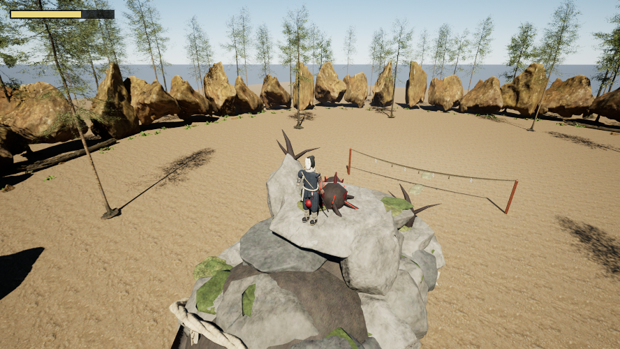 | 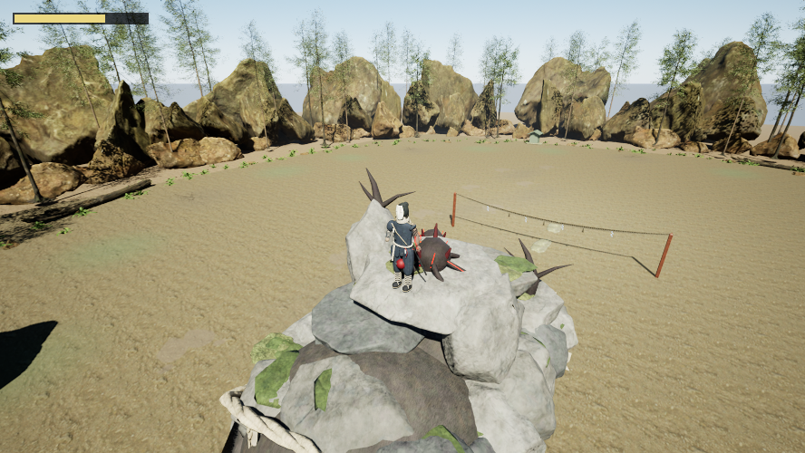 |

実PNG: 888×500 / 888×500。位置差 0.000000 cm、FOV差 +0.000000°。

位置差XYZ (cm): `{"x": 0.0, "y": 0.0, "z": 0.0}`。回転差PYR (°): `{"pitch": 0.0, "yaw": 0.0, "roll": 0.0}`。

## 禍根浄化後の1/3状態

撮影元: `Climbing/07-Purification`。Before RunId `4cb2cbc67955419596bcb45d8beec3b5`、After RunId `24d5ba6c2d744a6593a47a6c3a08c352`。

| Before | After |
| --- | --- |
| 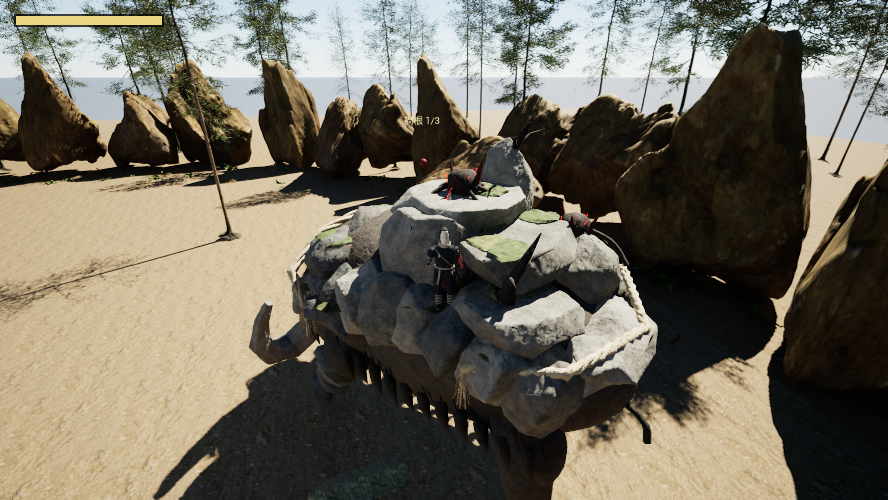 | 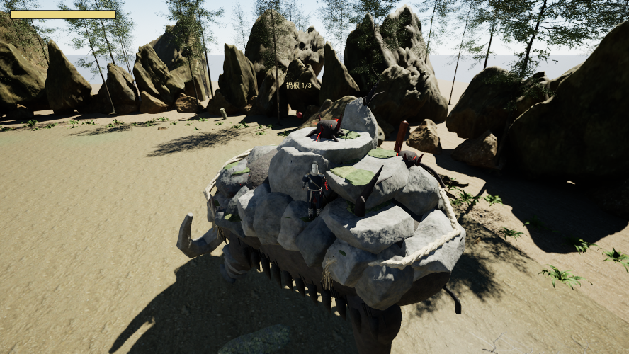 |

実PNG: 888×500 / 888×500。位置差 0.000000 cm、FOV差 +0.000000°。

位置差XYZ (cm): `{"x": 0.0, "y": 0.0, "z": 0.0}`。回転差PYR (°): `{"pitch": 0.0, "yaw": 0.0, "roll": 0.0}`。

## 鎮静後の風景

撮影元: `Climbing/05-Victory`。Before RunId `4cb2cbc67955419596bcb45d8beec3b5`、After RunId `24d5ba6c2d744a6593a47a6c3a08c352`。

| Before | After |
| --- | --- |
| 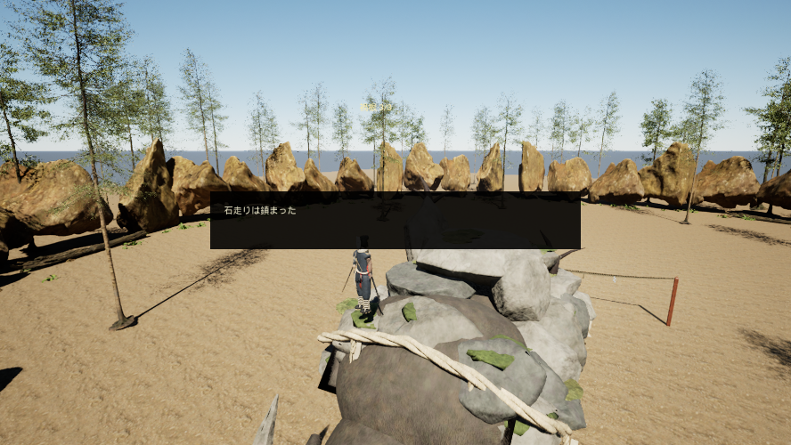 | 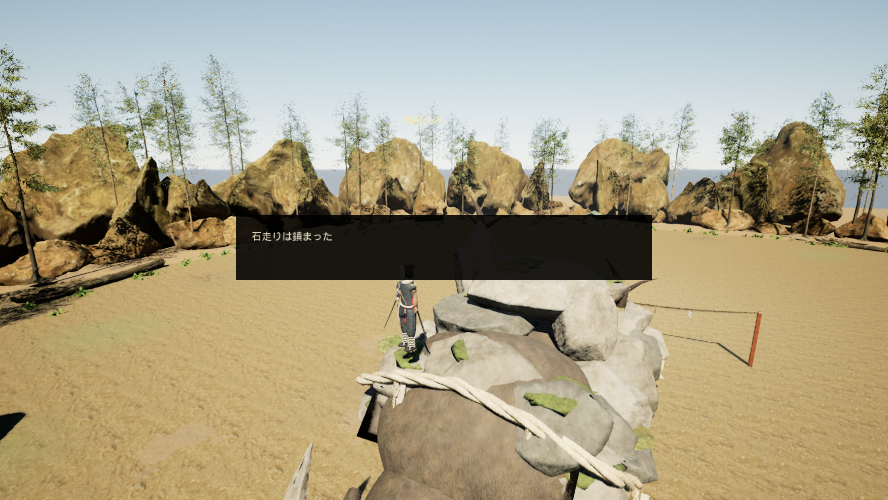 |

実PNG: 888×500 / 888×500。位置差 0.000000 cm、FOV差 +0.000000°。

位置差XYZ (cm): `{"x": 0.0, "y": 0.0, "z": 0.0}`。回転差PYR (°): `{"pitch": 0.0, "yaw": 0.0, "roll": 0.0}`。
