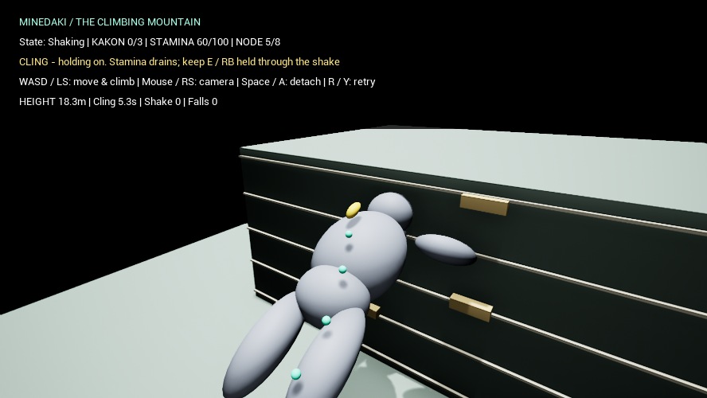
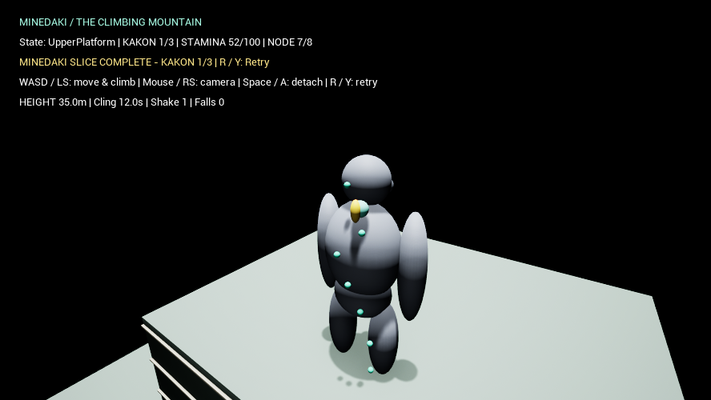

# 峰抱き — 動く身体を登るPrimitive Slice

基準は`main`の`da268ca`（淵纏いRecovery統合）。第一禍根までで止める。非Playableの進行予約2枠を除き、禍根2・3、Calm、Encounter Completed、Victoryは追加しない。

## 起動・操作

```powershell
.\Tools\Prototype.ps1 -Action Play -Minedaki
.\Tools\Prototype.ps1 -Action Test -Minedaki -SkipBuild -TestFPS 60
.\Tools\Prototype.ps1 -Action Test -Minedaki -SkipBuild -TestFPS 30
.\Tools\Prototype.ps1 -Action Test -Minedaki -SkipBuild -Gamepad -TestFPS 60
.\Tools\Prototype.ps1 -Action Test -Minedaki -SkipBuild -Capture -TestFPS 60
```

通常起動は石走り、`-Fuchimatoi`は淵纏いのまま。同じ空マップを専用GameModeで起動する。

1. WASD / 左スティックで左脚の緑の点へ近づき、E / RBでGrab。
2. W / 左スティック上で背中中央のNODE 5まで登る。
3. 身体が動き始めたら **E / RBを押し続けてCling**。壁登り中はPlayerのルート移動が停止する。
4. 上段のNODE 5で待つとスタミナが回復する。
5. NODE 7（首に近い肩甲骨上部）へ進み、左クリック / Xで第一禍根を祓う。
6. `MINEDAKI SLICE COMPLETE`と`KAKON 1/3`を確認し、R / Yで再挑戦。

Mouse / 右スティックでカメラ、Space / Aで手を離す。E / RBを離すとClingだけ解除し、通常Grabは続く。既存ルート登攀と同じ操作。

## 仕様・報告35項目

| # | 項目 | 内容 |
|---|---|---|
| 1 | 変更ファイル | `Public/Private/MinedakiBoss`, `MinedakiPlayer`, `MinedakiArena`, `MinedakiGameMode`, `MinedakiHUD`, `MinedakiIntegrationTest`の各`.h/.cpp`、`Private/MinedakiTests.cpp`、`Tools/Prototype.ps1`、README、本書と検証記録・画像 |
| 2 | 新規クラス | `AMinedakiBoss : ANushiBase`、`AMinedakiPlayer : ACharacter`、`AMinedakiArena`、`AMinedakiGameMode`、`AMinedakiHUD`、`AMinedakiIntegrationTest` |
| 3 | Arena | Cube床、壁兼上段Cube、4つのHand Hold、高さ目印。壁面X=-2100cm、上段Z=2000cm |
| 4 | Primitive | Sphereを伸ばしたHead/Torso/Pelvis/左右Arm/左右Leg、Muzzle、ルート表示、第一禍根表示。Engine標準素材 |
| 5 | サイズ | 直立高さ1830cm（18.3m）、胴の肩幅650cm。腕込み最大幅約1000cm |
| 6 | 階層 | `MinedakiRoot → BodyRoot → Body parts / Route markers / BodyGrabFrame Actor / Kakon Actors`。姿勢はBodyRoot、移動はBoss Actor |
| 7 | Action | Grounded → PreparingClimb → ClimbingWall → Shaking → ClimbingWall → LedgeTransition → UpperPlatform |
| 8 | Ground Route | 0左ふくらはぎ → 1太腿 → 2腰 → 3背中下部 → 4背中中央。HUDは1始まり |
| 9 | 開始条件 | Active中にNode 4到達。突進・噛みつき・Navigationは使わない |
| 10 | Transform | 下表の区間補間。壁面区間は2回の持ち上げに分かれ、途中で支持腕を掛け直す |
| 11 | 最大回転 | BodyRoot Pitch70°、Yaw20°、Shake中Roll24°。上段で直立へ戻る |
| 12 | 追従 | `PlayerWorld = RelativeGrabTransform * BodyGrabFrame.WorldTransform`。位置・回転を保持 |
| 13 | Grab再利用 | 無改変の`UGrabComponent`。脚Nodeとの距離を検査してBodyRoot配下のActorを掴む。ルート移動は相対位置を補間 |
| 14 | Stamina | 無改変の`UStaminaComponent`。最大100、Grab開始最低25、静止2/s、登攀5/s、壁3/s、Cling追加1/s、Shake成功8、地上/上段Node4休息22/s。PlayerのEditAnywhereで調整 |
| 15 | Cling | 既存GrabアクションのPressed/Released（E/RB）。壁ではルート移動を止め、姿勢への追従を継続 |
| 16 | Shake | 壁区間40–65%で横へ傾き、50%の通過で1回判定。Clingなし、または残StaminaがShakeCost以下なら落下。腕Primitiveを肩と壁の支持点の間へ向け、片腕ずつ位置を変える |
| 17 | Fall | Grab解除、世界の直立へ復帰して落下。地面/上段への着地後は地上へ戻す。失敗表示後R/YでRetry。Recoveryは未実装 |
| 18 | 上段高さ | 地上+20m。上段の背中中央でPlayer中心は約31.9m |
| 19 | Upper Route | 4背中中央（休息）→ 5肩 → 6首付近の肩甲骨上部（禍根）→ 7頭付近 |
| 20 | Kakon1 | BodyRootローカル(230,-90,1500)cm。UpperPlatform到達時にCoveredからExposedへ |
| 21 | Progress | 指定の共通Nushi 5クラスを使用。残り2個をCovered・非表示・衝突なし・遠隔ローカル位置で登録。入力から触れるAPIは第一禍根だけ |
| 22 | Slice判定 | 第一禍根のPurified状態。共通進行1/3、Nushi=Active、Encounter=Runningを維持。専用Progressを作らない |
| 23 | Telemetry | Grab試行/成功、到達Node数、壁開始、Cling秒数、Shake、落下、枯渇、上段到達、第一禍根、経過/完了秒数。`MINEDAKI_TELEMETRY`をイベントとRetry時に記録 |
| 24 | Automation | ActionLifecycle、LocalTransformFollow、ExhaustionRetry。実行結果は[検証記録](MinedakiValidation.json) |
| 25 | Transformテスト | 3Dアセット非依存。親Actorの位置/Yawと子SceneComponentのPitch/Rollを30/60/120FPSで変更し、相対位置・回転を測定 |
| 26 | Input-driven | 入力だけで2周＋Retry、Clingなしの落下＋Retry。全フレームでWorld姿勢誤差、壁区間で相対姿勢不変を測定 |
| 27 | 60FPS | 固定時間ステップ。攻略・描画の実行結果は検証記録 |
| 28 | 30FPS | 同じ入力経路を固定時間ステップで検証 |
| 29 | Gamepad | 60FPS、既存マッピングへ模擬デバイスイベントを入力。物理デバイスの実機操作ではない |
| 30 | 石走りRegression | `-Climbing -Basin`、`-Grab`、`-Camera -Basin`。60FPS、各RunIdのPASSを確認 |
| 31 | 淵纏いRegression | `-Fuchimatoi`と`-Fuchimatoi -Recovery`。60FPS、各RunIdのPASSを確認 |
| 32 | Screenshot | 生データ`Saved/Screenshots/Minedaki/<RunId>/`、レビュー用`Docs/MinedakiCaptures/` |
| 33 | 未検証 | 物理ゲームパッドの操作感、人間の連続プレイ、実時間30/60FPSを維持する性能、パッケージ版、全方向カメラの遮蔽 |
| 34 | 弱点3つ | ①固定ルートで壁移動中の判断はCling中心。②腕は伸縮するPrimitiveで、関節・接触の自然さは未完成。③落下後は全Retryで途中Recoveryがない |
| 35 | 次の作業 | 実機でカメラ・Cling予告・スタミナ余裕を評価し調整。その後に手の接触表現と落下Recoveryを改善。禍根2・3や完成モデルはSliceの評価後 |

### 身体の移動と回転

cm・degree。初期Boss Transform基準の移動とBodyRootの姿勢を分ける。`AdvanceWallClimb(DeltaSeconds)`が唯一の進行計算で、Runtime TickとAutomationから使用する。区間補間はsmoothstep。無効な時間/期間では進めない。

| 区間 | 秒 | Boss移動 | BodyRoot回転 |
|---|---|---|---|
| Preparing | 0–2 | (0,0,0) → (-350,0,250) | Pitch0/Yaw0 → 35/8 |
| Wall first pull | 2–5.5 | Xを-650へ近づけ、Z250→1150 | Pitch70へ、Yaw20へ |
| Wall second pull | 5.5–9 | Z1150→2150、Yに最大80の揺れ | Pitch70/Yaw20、壁区間40–65%にRoll最大24 |
| Ledge | 9–12 | (-650,0,2150) → (-2950,0,2000) | Pitch70/Yaw20 → 0/0 |

Boss Tick → Player Tick（Stamina/Route更新）→ Grab Tick（最終World Pose）→ 入力テスト測定、の依存順を設定する。Playerは身体の傾きに追従し、カメラのRollは0で水平を保つ。

### 検証の区別

`ActionLifecycle`は明示Advanceと状態操作のfixture。`LocalTransformFollow`はCharacter、SceneComponent階層、共有Grabのみ。`ExhaustionRetry`はStaminaを直接枯渇させる境界fixture。

入力テストはPlayerControllerへキー/ゲームパッドイベントを注入する。攻略中に位置、Stamina、Boss時間、禍根状態を直接書き換えない。固定時間ステップの成功を実時間性能や手動の操作感の証拠にはしない。

既存mainには`CR_Shirotsura_Climbing`未配置の起動ログがあり、今回も出る。結果は各RunIdのPASSとAutomationの各テスト結果で判断する。この既存アセットは変更しない。

### 実行結果（2026-09-14 JST）

UE 5.6.1 Editor/UHTビルド成功。Automationは3/3 PASS、30/60/120FPSの相対Transform誤差は位置0.00000000cm、回転0.00000592°。入力攻略は60FPS描画58.649秒、30FPS 58.733秒、60FPSゲームパッド58.983秒で、各2周と落下Retryを完了。すべてPitch70°/Yaw20°/Roll24°を観測し、追従誤差は位置0.000000cm、回転0.000006°。

石走りの指定3経路と淵纏いの通常・RecoveryもPASS。これらの後に峰抱きだけの腕・照明・カメラを調整し、峰抱きの入力と描画を再検証した。共通コンポーネントと既存Bossのコードは変更していない。RunIdと生ログへのパスは[検証JSON](MinedakiValidation.json)に保存した。

Automationの再実行例（UEインストール先は環境に合わせる）:

```powershell
& "$env:USERPROFILE\UnrealEngine\UE_5.6\Engine\Binaries\Win64\UnrealEditor-Cmd.exe" `
  "$PWD\IshibashiriPrototype.uproject" -unattended -nullrhi -nosound `
  '-ExecCmds=Automation RunTests IshibashiriPrototype.Nushi.Minedaki' `
  '-TestExit=Automation Test Queue Empty' `
  "-ReportExportPath=$PWD\Saved\MinedakiValidation\Automation"
```




